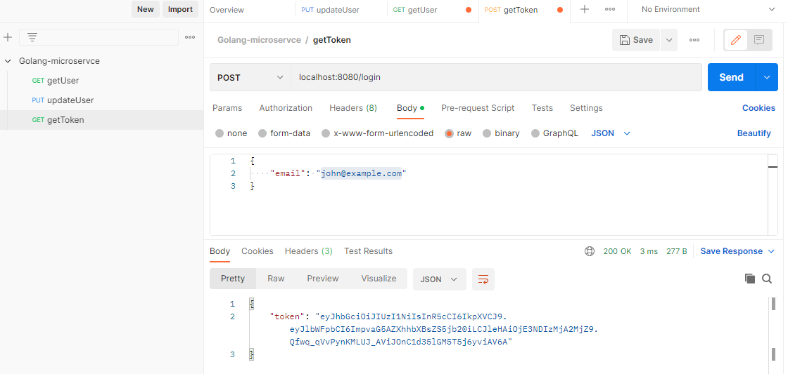
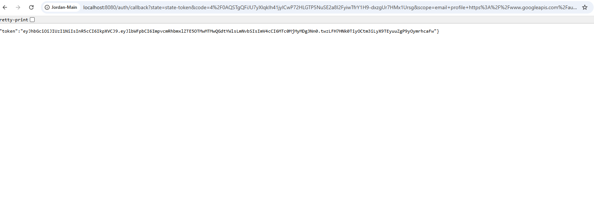
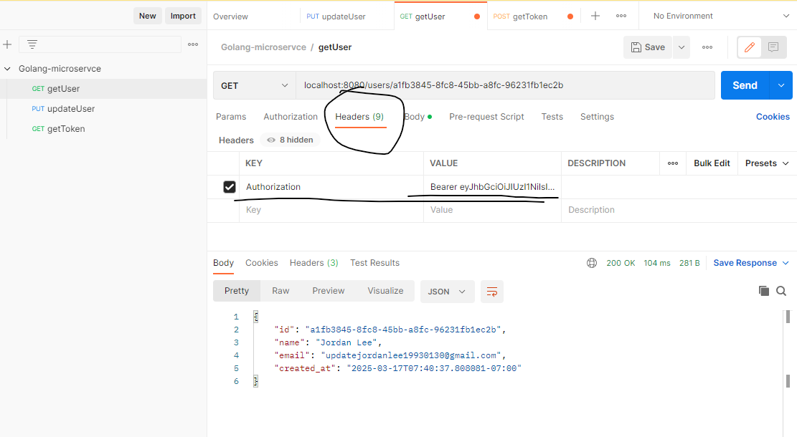

# go-user-microservice-assessment
A simple Go-based microservice for managing users with CRUD operations and PostgreSQL integration.

---
## Table of Contents

1. [Project Structure](#project-structure)
2. [Install dependencies](#install-dependencies)
3. [Set up the environment](#set-up-the-environment)
4. [Running Migrations](#running-migrations)
5. [Start the Server](#start-the-server)
6. [Testing the API](#testing-the-api)

---
### Project Structure
```
golang-microservice/
│── main.go
│── config/
│   └── config.go
│── models/
│   └── user.go
│── routes/
│   └── user_routes.go
│── controllers/
│   └── user_controller.go
│── migrations/
│   └── migrate.go
│── .env
│── go.mod
│── go.sum
│── README.md
```

---
### Install dependencies
```
   go mod tidy
```
---
### Set up the environment
```
   DB_HOST=localhost
   DB_USER=postgres
   DB_PASSWORD=postgres
   DB_NAME=userdb
   DB_PORT=5432
   SERVER_PORT=8080
   OAUTH_CLIENT_ID=Your Client ID
   OAUTH_CLIENT_SECRET=Your Client Secret
   OAUTH_REDIRECT_URL=http://localhost:8080/auth/callback
   OAUTH_AUTH_URL=https://accounts.google.com/o/oauth2/auth
   OAUTH_TOKEN_URL=https://oauth2.googleapis.com/token
   OAUTH_USERINFO_URL=https://www.googleapis.com/oauth2/v2/userinfo
   JWT_SECRET=Your Secret
```
---
### Running Migrations
```
   go run migrations/migrate.go
```
---
### Start the Server
```
   go run main.go
```
---
### Testing the API
#### Get Token by Email
```
   POST /login
   {
      "email": "john@example.com"
   }
```

#### Get Token by OAuth2 with Google
```
   GET /auth/login
```

#### Create a User
```
   POST /users
   {
      "name": "Jordan Lee",
      "email": "jordanlee19930130@gmail.com"
   }
```


#### Get User by ID
```
   GET /users/{id}
```

#### Update User
```
   PUT /users/{id}
   {
   "name": "Jordan Nicle Lee",
   "email": "jordanlee19930130@gmail.com"
   }
```

#### Delete User
```
   DELETE /users/{id}
```

This readme is not completed, because with JWT token, you have to add token in header like this:



And I didn't add some validation error results.
But all feature are implemented.
If you have any uqestions, please let me know.
Thanks
Jordan
415 800 2968
jordanlee19930130@gmail.com
https://t.me/allpyjs